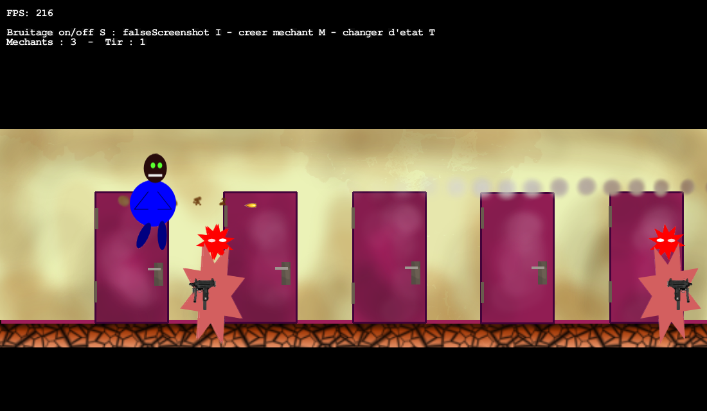

Kennedy's game - slick
=================

Attempt to create a game representing what was life in a flat called 'kennedy' in Poitiers, France - in JAVA + lwgjl + slick2d

# Compil and run
``` bash
./build_and_run.sh
```

# Screenshot
Demo 

Only tested on

 + mac 10.9.5
 + java version "1.6.0_65"
 + lwgjl 2.9

# LICENSE

MIT
